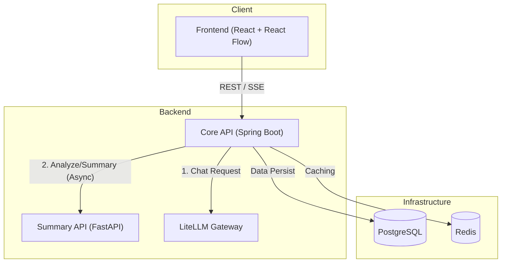

<div align="center">
  
  <h1>TTIBU-TTIBU-CHAT</h1>
  <p align="center">
    <b>그래프 기반 LLM 대화 제어 & 시각화 플랫폼</b><br>
    대화의 흐름을 자유롭게 <b>분기(Branching)</b>하고, <b>병합(Merging)</b>하며 실험하세요.
  </p>
  <p align="center">
    <!-- FE -->
    
    
    
    <br>
    <!-- BE -->
    
    
    
    
    <br>
    <!-- DB -->
    
    
    <!-- Infra -->
    
  </p>
</div>

---

<br>
<div align="center">

  [🚀 빠른 시작](#-빠른-시작) | [💡 주요 기능](#-주요-기능) | [💻 로컬 개발 환경](#-로컬-개발-환경)

</div>
<br>

---

# 🧭 개요

**TTIBU-TTIBU-CHAT**은 기존의 선형적인(Linear) 채팅 인터페이스를 탈피하여, **그래프(Graph)** 형태로 LLM과의 대화를 시각화하고 조작하는 **한국어 특화 오픈소스 플랫폼**입니다.

개발자와 프롬프트 엔지니어는 대화의 특정 시점으로 돌아가 **가지치기(Branching)** 를 하거나, 서로 다른 대화 맥락을 **이어 붙이는(Linking)** 등 직관적인 실험이 가능합니다. **LiteLLM**을 통해 다양한 LLM Provider를 손쉽게 통합하여 사용할 수 있습니다.
<br><br>

---

# 💡 주요 기능

### 🔗 **채팅 붙이기**
두 개의 서로 다른 메시지 노드를 연결하여 대화 흐름을 병합합니다. 문맥을 재구성할 때 유용합니다.
  

### ✂️ **채팅 떼기**
잘못 연결되거나 불필요한 대화 흐름을 끊어내어 노이즈를 제거하고 새로운 흐름을 만듭니다.
  

### 🗂️ **채팅 그룹화**
복잡해진 그래프 노드들을 주제별로 묶어 정리하고, 가시성을 확보합니다.
  <br><br>
  

### 🌿 **대화 분기**
특정 메시지에서 새로운 가지(Branch)를 생성하여 여러 프롬프트 전략을 동시에 실험합니다.
  

### 🧠 LLM Provider 통합(LiteLLM)
OpenAI · Anthropic · Google · DeepSeek 등  
다양한 LLM Provider를 **하나의 통합 API**로 사용합니다.
<br><br>

---

# 🚀 빠른 시작

### 1. 사전 요구사항
프로젝트를 실행하기 위해 다음 도구들이 설치되어 있어야 합니다.
- Docker & Docker Compose
- Git

### 2. 설치 및 실행

> 아래 명령어는 **Bash 쉘(Linux/macOS, Git Bash 등)** 기준입니다.
```bash
git clone https://github.com/TTIBU-TTIBU-CHAT/TTIBU-TTIBU-CHAT.git
cd TTIBU-TTIBU-CHAT
docker compose up -d
```
<br>

---

# 🏗️ 아키텍처

`React Flow` 기반의 프론트엔드와 `Spring Boot` 코어 서버, 그리고 LLM 처리를 담당하는 `FastAPI` 워커로 구성되어 있습니다.

Core API가 **LiteLLM**을 통해 채팅 응답을 생성하고, 대화가 완료되면 **FastAPI** 워커에게 비동기로 요약 및 키워드 추출을 요청하여 DB에 저장하는 구조입니다.




<br>

---

# 🔧 기술 스택

| 영역 | 기술 |
|------|------|
| **Frontend** | React 19, React Flow, Vite |
| **Backend** | Java 17, Spring Boot 3.5.7, JPA, Spring Security, SSE |
| **Worker** | Python 3.11, FastAPI 0.121.0, [LiteLLM](https://github.com/BerriAI/litellm) |
| **Database** | PostgreSQL 15, Redis 7 |
| **Infra** | Docker, Docker Compose |
<br>

---

# 💻 로컬 개발 환경

### Core API
```bash
cd core-api
./gradlew bootrun
```

### Summary API (Worker)
```bash
cd summary-api
uvicorn app.main:app --reload --port 8001
```

### Frontend
```bash
cd frontend
npm install
npm run dev
```
<br>

---
# ⚙️ 고급 설정 (환경 변수)
> 아무 설정도 하지 않으면 `application.yml`의 기본 값이 사용되며,  
> **고급 사용자는 이 섹션의 값들을 커스텀해서 자신만의 환경을 만들 수 있습니다.**

### .env
```env
# LiteLLM Configuration
LITELLM_MASTER_KEY=your-master-key
LITELLM_BASE_URL=http://litellm:your-port
LITELLM_MODEL=your-model

# TTIBU Application Security
TTIBU_CRYPTO_SECRET=your-custom-api-key-secret

# FastAPI Summary Service
SUMMARY_API_BASE_URL=http://summary-api:your-port
SUMMARY_API_TIMEOUT_MS=30000
```
<br>

---

# 🤝 기여

*이 프로젝트는 오픈소스입니다. **버그 제보**, **기능 제안**, **코드 기여** 모두 언제나 환영합니다!*

작업을 시작하기 전에 [**새로운 이슈**](https://github.com/TTIBU-TTIBU-CHAT/TTIBU-TTIBU-CHAT/issues)를 등록하여 어떤 작업을 할 것인지 먼저 논의해 주세요.

1. **Issue 생성**: 버그를 발견하거나 새로운 기능을 제안하고 싶다면 먼저 이슈를 생성합니다.

2. **Fork**: 이 저장소를 본인의 계정으로 Fork 합니다.

3. **Branch 생성**: 새로운 기능 브랜치를 생성합니다. (`git checkout -b BE/feature/new-feature`)

4. **Commit**: 변경 사항을 커밋합니다. (`git commit -m 'feat: add new feature'`)

5. **Push**: 본인의 Fork 저장소로 푸시합니다. (`git push origin BE/feature/new-feature`)

6. **Pull Request**: 원본 저장소로 `Pull Request`를 요청합니다.

### 기여자

<a href="https://github.com/TTIBU-TTIBU-CHAT/TTIBU-TTIBU-CHAT/graphs/contributors">
  
</a>
<br><br>

---

# 📜 라이선스 

**TTIBU-TTIBU-CHAT**은 MIT 라이선스에 따라 배포됩니다. <br>
자세한 내용은 프로젝트의 LICENSE 파일을 참고하세요.